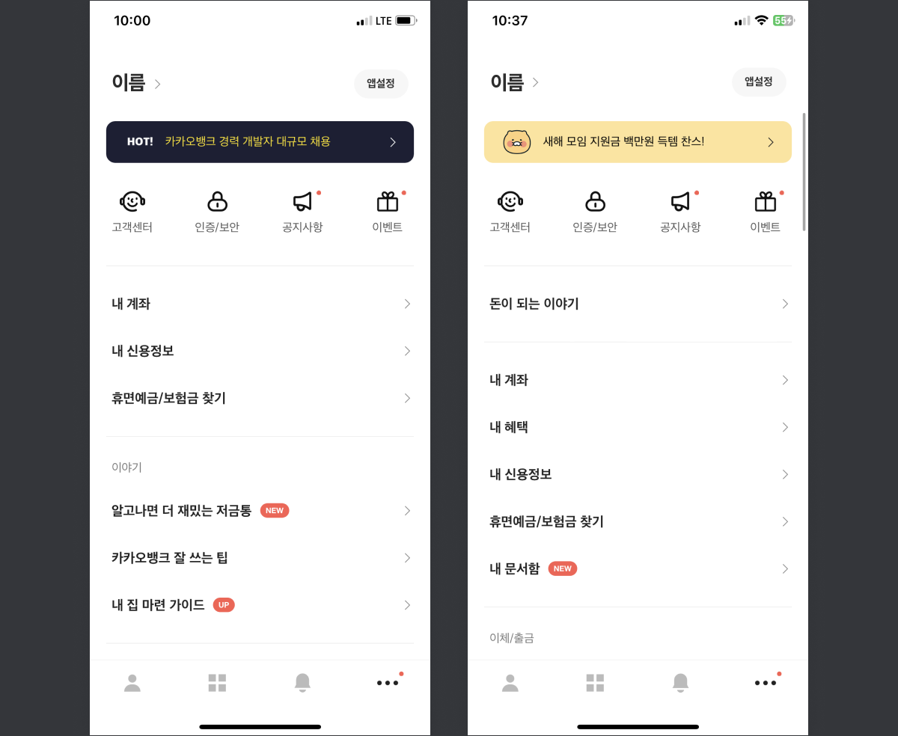

<!-- logo -->

# 📊사용자 투자 관심도 분석📉

   
  

 

 

 
 

## 📜 프로젝트 개요
핀테크 애플리케이션에서 다양한 사용자 행동(방문, 구매, 클릭 행동 등)에 대한 분석을 수행합니다. 이러한 통계 분석된 데이터는 회사 PM, 데이터 분석가 및 관계자들이 기존 제품의 현황을 분석하고, 사용자 행동 분석 결과를 바탕으로 제품 설계를 지속적으로 개선하며, 회사의 전략 및 사업을 조정하는 데 도움을 주게됩니다. 이 중 해당 프로젝트에서는 범위 내의 방문 시간 비율 및 방문 길이 비율 통계 기능을 구현합니다.

### **주요 기능**

- 사용자 행동 로그 수집 및 처리
- 세션 단위의 데이터 분석
- Accumulator를 활용한 집계
- 데이터 필터링
- MySQL 저장 및 BI 연동

 

## 🛠️ 데이터 프로세스
Spark Core를 사용하여 배치 처리 방식으로 로그를 추출하고. 추출한 로그를 아래와 같이 처리합니다.

 

 
 

## 📋 요구사항 분석

 

**1. 데이터 수집**

- Hive에서 사용자 로그를 가져와 Spark RDD로 변환
- 로그 형식: Parquet

**2️. 데이터 처리**

- 세션 단위 그룹핑 (session_id 기반)
- Accumulator를 활용하여 실시간 통계 계산
- 사용자 속성 및 행동 데이터 필터링

**3️. 데이터 저장**

- MySQL에 통계 데이터를 저장

 

## 📂 프로젝트 구조 
 

      │── scala
      │   ├── analysis
      │   │   ├── session
      │   │   │   ├── accumulator
      │   │   │   ├── bean
      │   │   │   ├── Function
      │   │   │   ├── APP.scala
      │   ├── commons
      │   │   ├── conf
      │   │   ├── constant
      │   │   ├── model
      │   │   ├── utils

### **주요 디렉토리 설명**

**1️. analysis (데이터 분석)**

- `session/APP.scala`: 세션 분석의 메인 실행 파일
- `session/accumulator/SessionAggrStatAccumulator.scala`: Spark Accumulator 활용한 통계 분석
- `session/bean/`: 세션 관련 데이터 모델
    - `SessionAggrStat.scala`: 세션 통계 결과 저장
- `session/Function/`: 데이터 처리 함수
    - `Demand1Function.scala`: 핵심 분석 로직
    - `UserSessionAnalysisFunction1.scala`: 사용자 세션 분석 실행

**2️. commons (공통 설정 및 유틸리티)**

- `conf/ConfigurationManager.scala`: 설정 파일 로드
- `constant/Constants.scala`: 프로젝트 상수 저장
- `model/`: 데이터 모델
    - `ProductInfo.scala`: 제품 정보 저장
    - `UserInfo.scala`: 사용자 정보 저장
    - `UserVisitAction.scala`: 사용자 행동 데이터 저장
- `utils/`: 유틸리티 함수
    - `DateUtils.scala`: 날짜 변환
    - `NumberUtils.scala`: 숫자 변환
    - `ParamUtils.scala`: 매개변수 처리
    - `StringUtils.scala`: 문자열 유틸리티
    - `ValidUtils.scala`: 데이터 검증

 
 

## 🤔 기술적 이슈와 해결 과정

Spark 병목 해결을 통해 72% 성능 개선하기 v1
https://heonyz.tistory.com/11

Spark 병목 해결을 통해 72% 성능 개선하기 v2
https://heonyz.tistory.com/12

NotSerializableException, Task not serializable 문제를 마주했다면
https://heonyz.tistory.com/10

 
